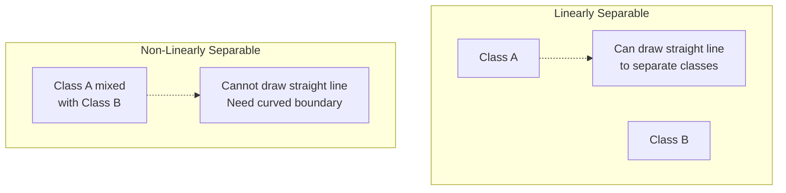

# Linear Separability Diagram

## Mermaid Diagram



## ASCII Visualization

### Linearly Separable (Perceptron CAN learn):

```
    Class A         │        Class B
                    │
       ●            │            ○
         ●          │          ○
       ●   ●        │        ○   ○
         ●          │          ○
       ●            │            ○
                    │
    ────────────────┼────────────────
                    │
                    │  ← Decision Boundary
                    │     (Straight Line)
```

### Non-Linearly Separable (Perceptron CANNOT learn):

```
    XOR Problem (Example)
    
         ○            ●
                           
                           
    
         ●            ○
    
    No single straight line can separate:
    ● (Class 1: outputs 1)
    ○ (Class 0: outputs 0)
    
    Needs curved boundary:
         ╱‾‾‾╲
       ○│  ●  │○
         ╲___╱
           ●
```

## Examples

### ✅ Linearly Separable Problems (Perceptron CAN solve):

1. **OR Gate**:
   ```
   (0,0)→0  │  (0,1)→1
   ─────────┼──────────
   (1,0)→1  │  (1,1)→1
   ```

2. **AND Gate**:
   ```
   (0,0)→0  │  (0,1)→0
   ─────────┼──────────
   (1,0)→0  │  (1,1)→1
   ```

3. **Simple Classification**:
   - Separating cats from dogs based on weight and height
   - If data can be divided by a straight line/plane

### ❌ Non-Linearly Separable Problems (Perceptron CANNOT solve):

1. **XOR Gate** (Exclusive OR):
   ```
   (0,0)→0  │  (0,1)→1
   ─────────┼──────────
   (1,0)→1  │  (1,1)→0
   
   Diagonal pattern - no straight line works!
   ```

2. **Circular Patterns**:
   - Class A in the center, Class B around it
   - Requires circular decision boundary

3. **Complex Interleaved Data**:
   - When classes are mixed in complex patterns
   - Needs multiple decision boundaries

## Solution for Non-Linear Problems:

Use **Multi-Layer Perceptrons (MLPs)** or **Neural Networks**:
- Stack multiple perceptrons in layers
- Can learn complex, non-linear decision boundaries
- XOR can be solved with 2 layers

```
Input Layer → Hidden Layer → Output Layer
    (2)           (2)            (1)
    
Can solve XOR and other non-linear problems!
```

## Mathematical Definition:

**Linearly Separable**: A dataset is linearly separable if there exists a hyperplane:

```
w₁x₁ + w₂x₂ + ... + wₙxₙ + b = 0
```

that perfectly separates all samples of one class from the other class.

In 2D: A straight line
In 3D: A plane
In n-D: A hyperplane

