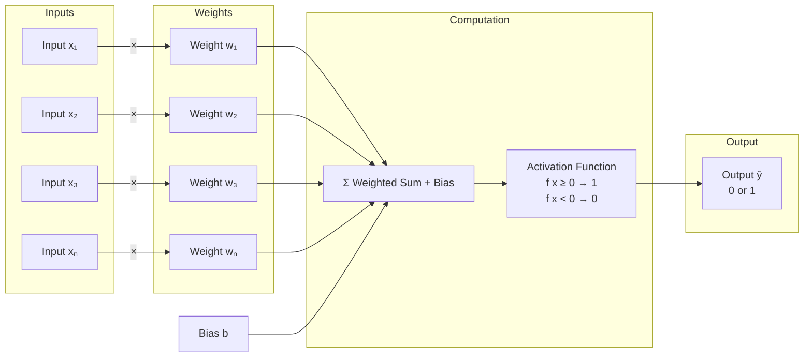

# Perceptron Architecture Diagram

## Mermaid Diagram



## ASCII Diagram

```
┌─────────┐
│ Input x₁│───┐
└─────────┘   │ ×w₁
              │
┌─────────┐   │    ┌──────────────────┐     ┌─────────────┐     ┌──────────┐
│ Input x₂│───┼───→│  Σ (Weighted     │────→│ Activation  │────→│ Output ŷ │
└─────────┘   │ ×w₂│    Sum + Bias)   │     │  Function   │     │  (0 or 1)│
              │    └──────────────────┘     │  Step(x)    │     └──────────┘
┌─────────┐   │                             └─────────────┘
│ Input x₃│───┘ ×w₃
└─────────┘   
              ↑
┌─────────┐   │
│ Input xₙ│───┘ ×wₙ
└─────────┘
              ↑
        ┌──────────┐
        │ Bias (b) │
        └──────────┘
```

## Description

This diagram shows the architecture of a single perceptron:

1. **Inputs Layer** (x₁, x₂, ..., xₙ): The input features
2. **Weights** (w₁, w₂, ..., wₙ): Learned parameters that multiply each input
3. **Summation Node** (Σ): Computes weighted sum of all inputs plus bias
4. **Activation Function**: Step function that outputs 1 if sum ≥ 0, else 0
5. **Output** (ŷ): Binary classification result (0 or 1)

### Formula:
```
ŷ = f(Σ(wᵢ × xᵢ) + b)

where f(z) = 1 if z ≥ 0, else 0
```

