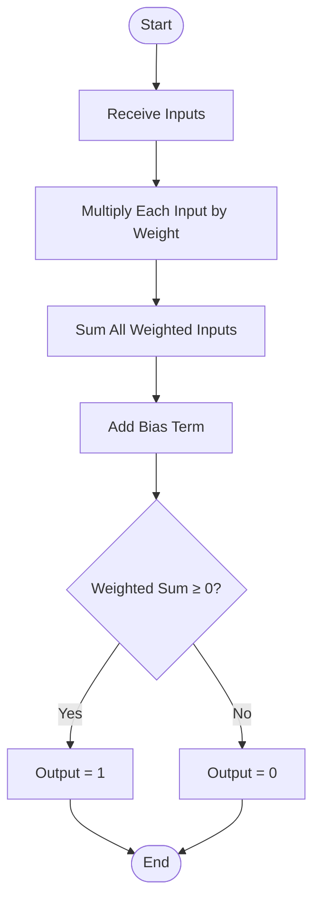

# Prediction Flow Diagram

## Mermaid Diagram



## ASCII Flowchart

```
        ┌─────────────┐
        │   START     │
        └──────┬──────┘
               │
               ▼
        ┌─────────────┐
        │   Receive   │
        │   Inputs    │
        └──────┬──────┘
               │
               ▼
        ┌─────────────┐
        │  Multiply   │
        │  Each Input │
        │  by Weight  │
        └──────┬──────┘
               │
               ▼
        ┌─────────────┐
        │   Sum All   │
        │   Weighted  │
        │   Inputs    │
        └──────┬──────┘
               │
               ▼
        ┌─────────────┐
        │  Add Bias   │
        │    Term     │
        └──────┬──────┘
               │
               ▼
        ╔═════════════╗
        ║  Weighted   ║
        ║  Sum ≥ 0?   ║
        ╚══════╦══════╝
               │
       ┌───────┴───────┐
       │               │
     Yes              No
       │               │
       ▼               ▼
┌────────────┐  ┌────────────┐
│ Output = 1 │  │ Output = 0 │
└──────┬─────┘  └──────┬─────┘
       │               │
       └───────┬───────┘
               │
               ▼
        ┌─────────────┐
        │     END     │
        └─────────────┘
```

## Step-by-Step Process

1. **Receive Inputs**: Get input feature values [x₁, x₂, ..., xₙ]
2. **Multiply by Weights**: Compute x₁×w₁, x₂×w₂, ..., xₙ×wₙ
3. **Sum Weighted Inputs**: Calculate Σ(xᵢ × wᵢ)
4. **Add Bias**: z = Σ(xᵢ × wᵢ) + b
5. **Apply Activation**: Check if z ≥ 0
   - If yes → Output = 1
   - If no → Output = 0
6. **Return Output**: Final prediction (0 or 1)

