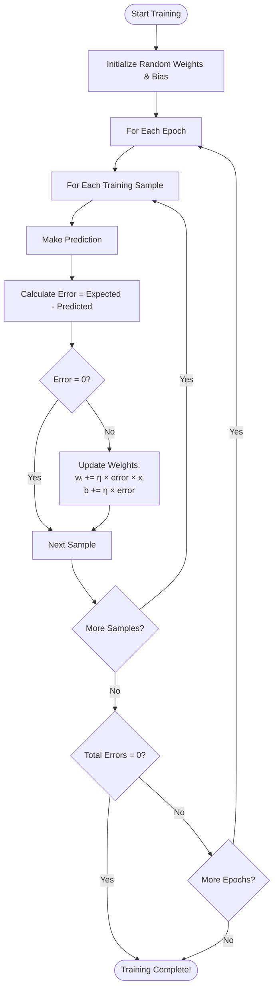

# Training Algorithm Flowchart

## Mermaid Diagram



## ASCII Flowchart

```
        ┌──────────────────┐
        │  Start Training  │
        └────────┬─────────┘
                 │
                 ▼
        ┌──────────────────┐
        │   Initialize     │
        │  Random Weights  │
        │    and Bias      │
        └────────┬─────────┘
                 │
                 ▼
     ╔═══════════════════╗
     ║  For Each Epoch   ║◄────────────┐
     ╚═════════┬═════════╝             │
               │                        │
               ▼                        │
     ╔═══════════════════╗             │
     ║ For Each Sample   ║◄─────┐      │
     ║  in Training Data ║      │      │
     ╚═════════┬═════════╝      │      │
               │                 │      │
               ▼                 │      │
        ┌──────────────────┐    │      │
        │  Make Prediction │    │      │
        └────────┬─────────┘    │      │
                 │                │      │
                 ▼                │      │
        ┌──────────────────┐    │      │
        │ Calculate Error: │    │      │
        │ Expected - Pred. │    │      │
        └────────┬─────────┘    │      │
                 │                │      │
                 ▼                │      │
          ╔══════════╗           │      │
          ║ Error=0? ║           │      │
          ╚════╦═════╝           │      │
               │                  │      │
        ┌──────┴─────┐           │      │
       No            Yes          │      │
        │              │           │      │
        ▼              │           │      │
 ┌─────────────┐      │           │      │
 │   Update    │      │           │      │
 │   Weights:  │      │           │      │
 │ wᵢ += η×e×xᵢ│      │           │      │
 │  b += η×e   │      │           │      │
 └──────┬──────┘      │           │      │
        │              │           │      │
        └──────┬───────┘           │      │
               │                    │      │
               ▼                    │      │
        ┌──────────────┐           │      │
        │ Next Sample  │           │      │
        └──────┬───────┘           │      │
               │                    │      │
               ▼                    │      │
        ╔══════════════╗           │      │
        ║ More Samples?║───Yes────┘      │
        ╚══════╦═══════╝                  │
               │No                         │
               ▼                          │
        ╔══════════════╗                 │
        ║Total Errors  ║                 │
        ║    = 0?      ║                 │
        ╚══════╦═══════╝                 │
               │                          │
        ┌──────┴─────┐                   │
       No            Yes                  │
        │              │                   │
        ▼              ▼                   │
 ╔═════════════╗  ┌────────────┐         │
 ║More Epochs? ║  │  Training  │         │
 ╚══════╦══════╝  │  Complete! │         │
        │Yes      └────────────┘         │
        └──────────────────────────────┘
               │No
               ▼
        ┌─────────────┐
        │  Training   │
        │  Complete!  │
        └─────────────┘
```

## Training Algorithm Steps

### Initialization:
1. Initialize all weights (w₁, w₂, ..., wₙ) with random values
2. Initialize bias (b) with random value

### For Each Epoch:
   
   ### For Each Training Sample:
   1. **Forward Pass**: Make prediction using current weights
      ```
      ŷ = f(Σ(wᵢ × xᵢ) + b)
      ```
   
   2. **Calculate Error**:
      ```
      error = y_expected - y_predicted
      ```
      Error can be: -1, 0, or 1
   
   3. **Update Weights** (only if error ≠ 0):
      ```
      For each weight wᵢ:
          wᵢ = wᵢ + η × error × xᵢ
      
      Bias:
          b = b + η × error
      ```
      where η = learning rate
   
   4. **Move to Next Sample**
   
   ### After All Samples:
   - Check if total errors = 0
   - If yes → Training Complete ✓
   - If no and more epochs → Continue training
   - If no and no more epochs → Training ends

### Key Parameters:
- **η (eta)**: Learning rate (e.g., 0.1)
- **epochs**: Maximum number of training iterations
- **error**: Difference between expected and predicted output

